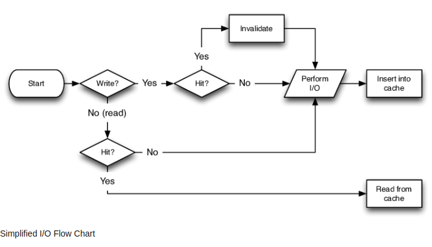
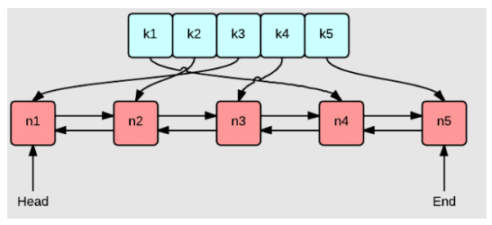

# Scalability
## 1. Single-Server Design:
Single Server Design (Monolithic Architecture),
A monolithic architecture, or single server design, refers to a web application structure where all components—such as the application server, database, web server, and user interface—are housed on a single server. While it offers simplicity and cost-effectiveness.

It may face challenges in scalability and maintenance as the application grows and it has single point of failure. 

## 2. Vertical Scaling:
Vertical scaling, also known as scaling up or upgrading, involves increasing the capacity of a single server or resource to handle greater loads. In this approach, you enhance the power of an individual machine, typically by adding more CPU, RAM, storage, or other resources. Vertical scaling is akin to making a computer more robust by upgrading its components. While it provides a straightforward way to boost performance. 

 It has limits, and there's a ceiling to how much a single server can be scaled vertically. Additionally, it may involve downtime during the upgrade process and still their is single point of failure.

## 3. Horizontal Scaling:
Horizontal scaling, also known as scaling out, is a method of expanding a system's capacity by adding more machines or servers to the network. Rather than upgrading a single server (vertical scaling), horizontal scaling distributes the workload across multiple machines. As demand grows, additional servers are introduced to collectively handle the increased load.

**Components of Horizontal Scaling:**

### 1. Load Balancer:
A crucial component in horizontal scaling is the load balancer. It evenly distributes incoming requests among the available servers, ensuring efficient utilization of resources and preventing any single server from being overloaded.

### 2. Server Nodes:
These are individual machines added to the system to collectively share the workload. Each server node operates independently, contributing to the overall processing capacity of the system.

### 3. Database Sharding:
In horizontal scaling, databases may be horizontally partitioned or sharded. Each shard contains a subset of the data, and multiple database servers collectively manage the entire dataset.

## Database Failover Strategies
### 1. Cold Standby:
A backup database server in a powered-off state, with periodic data updates from the primary database. Activation involves starting the server, restoring data, potentially leading to downtime.

Periodic Data Update: Backups maintain a snapshot of the primary database at specific intervals.  
Potential Data Loss: Depending on the backup frequency, there may be data loss.

### 2. Warm Standby:
It replicating data from the primary database. Requires synchronization with the primary database before full activation.

Moderate Activation Time: While faster than cold standby, synchronization steps may introduce some downtime.  
Resource Utilization: Consumes resources even when not processing the entire workload.

### 3. Hot Standby:
Here we actively updating backup data simultaneously with the primary database. It is in real-time synchronization and can be seamlessly activated for near-instant failover.

Resource Intensive: Maintaining a fully active duplicate system consumes significant resources.  
Complexity and Cost: Setting up and maintaining a hot standby system can be complex and may incur higher costs due to real-time synchronization.

## Horizontal scaling of Databases: Sharding
Horizontal scaling with sharding is a technique used to handle large amounts of data and increase database performance. Instead of storing all data on a single server, the database is divided into smaller pieces called shards, and each shard is placed on a separate server. This distribution of data across multiple servers allows the database to handle more users and transactions simultaneously, improving performance and scalability. Sharding enables parallel processing, flexibility in adding or removing servers, and efficient management of large datasets.

>**Example of DBs Like**  
**1. MongoDB**   
https://dba.stackexchange.com/questions/82551/data-distribution-in-mongos-with-shards-or-replica-sets  
**2. Cassandra**  
https://cassandra.apache.org/_/cassandra-basics.html

## Downside of NoSQL Database Sharding:
### 1. Complexity of Querying Across Shards:
Querying data that spans multiple shards can be complex. Performing joins or aggregations across shards may require additional effort and can impact performance.  
Example: In a sharded NoSQL database, if you need to perform a query that involves data from multiple shards, you may need to coordinate the query across the shards, which can introduce complexity.

### 2. Data Consistency Challenges:
Achieving strong consistency across shards in a distributed NoSQL database can be challenging. As data is distributed, ensuring that updates are consistent across all shards in real-time may lead to trade-offs in terms of latency or complexity.  
Example: If a write operation occurs on one shard and a read operation immediately follows on another shard, ensuring that the read reflects the most recent write in a consistent manner can be challenging.

### 3. Shard Key Selection Impact:
The choice of shard key is critical, and selecting an inappropriate shard key can lead to uneven data distribution, known as "hotspots," where certain shards handle a disproportionate amount of the workload.  
Example: If a poorly chosen shard key results in a few shards receiving a significantly higher volume of traffic or data, it can impact the overall performance and scalability of the sharded database.

### 4. Limited Support for Transactions Across Shards:
Some NoSQL databases may have limitations on supporting transactions that involve multiple shards. This limitation can impact the atomicity of operations across distributed data.      
Example: If a transaction involves updates to data on multiple shards, ensuring that either all updates succeed or all fail (atomicity) may be challenging in certain NoSQL databases.

### 5. Operational Overhead:
Managing a sharded environment introduces operational complexities. Tasks such as shard management, rebalancing, and ensuring data consistency require careful planning and monitoring.  
Example: Adding or removing shards dynamically to accommodate changes in data volume or traffic patterns requires coordination and may impact the overall operational workload.

## Normalized and Denormalized Data
| Feature                | Normalized Data                                       | Denormalized Data                                     |
|------------------------|-------------------------------------------------------|--------------------------------------------------------|
| **Objective**          | Eliminate redundancy and reduce data anomalies.      | Improve query performance by introducing redundancy.   |
| **Structure**          | Data organized into multiple related tables.         | Data may be duplicated to minimize the need for joins. |
| **Redundancy**         | Minimized to avoid storing the same information.      | Accepted and deliberately introduced.                  |
| **Advantages**         | Reduces data duplication and maintains consistency.  | Improves query performance for read-heavy workloads.    |
| **Read Operations**    | May involve joins for complex queries.                | Simplified queries, potentially better performance.     |
| **Write Operations**   | Generally simplified.                                | May introduce complexity due to data duplication.       |
| **Data Integrity**     | Maintains data integrity with reduced redundancy.    | Accepts redundancy, potential for inconsistencies.      |

### Normalized Data
Users Table:
| UserID | UserName | Email           |
|--------|----------|-----------------|
| 1      | Alice    | alice@email.com |
| 2      | Bob      | bob@email.com   |

BlogPosts Table:
| PostID | Title          | Content              | UserID |
|--------|----------------|----------------------|--------|
| 101    | Post 1 Title   | Post 1 Content       | 1      |
| 102    | Post 2 Title   | Post 2 Content       | 2      |

### Denormalized Data
UsersAndPosts Table:
| PostID | Title          | Content              | UserName | Email           |
|--------|----------------|----------------------|----------|-----------------|
| 101    | Post 1 Title   | Post 1 Content       | Alice    | alice@email.com |
| 101    | Post 1 Title   | Post 1 Content       | Bob      | bob@email.com   |
| 102    | Post 2 Title   | Post 2 Content       | Alice    | alice@email.com |
| 102    | Post 2 Title   | Post 2 Content       | Bob      | bob@email.com   |

### Dnormalization
Denormalization is a database optimization technique where redundant data is intentionally introduced into a database to improve query performance. In a denormalized database schema, the goal is to simplify and expedite the retrieval of data by reducing the need for joins and aggregations.

## Data Lakes
A data lake is a centralized repository that allows you to store and manage vast amounts of raw, unstructured, and structured data at scale. Unlike traditional databases and data warehouses, data lakes accept data of any type and structure, making them a flexible solution for storing large volumes of diverse data.

### Example of Amazon Data Lake
#### Data Ingestion and Storage (Amazon S3):
Raw data is ingested into Amazon S3, which serves as the primary storage for the data lake.
Data can be in various formats, including raw logs, customer reviews, and structured metadata.

#### Metadata Management and ETL Processing (AWS Glue):
AWS Glue is used for data cataloging and metadata management.
ETL processes in AWS Glue transform raw data into structured formats, extracting valuable insights and organizing metadata.

#### Serverless Querying (Amazon Athena):
Amazon Athena allows users to run SQL queries directly on data stored in Amazon S3.
No need to load data into a separate database; Athena provides a serverless, on-demand querying service.

#### Data Warehousing and Analytics (Amazon Redshift):
Amazon Redshift is utilized as a data warehousing solution for high-performance analytics.
Processed and structured data from the data lake or other sources is loaded into Amazon Redshift for complex queries and analytics.

### Data Flow

[ Data Ingestion & Storage ] --> [ Amazon S3 ]

[ Metadata Management & ETL Processing ] --> [ AWS Glue ]

[ AWS Glue ] --> [ Amazon Athena ]  
[ AWS Glue ] --> [ Amazon Redshift ]

## ACID Compliance
ACID (Atomicity, Consistency, Isolation, Durability) is a set of properties that guarantee the reliability of database transactions. 

### Atomicity
Either the entire transaction succeeds, or the entire thing fails.

Atomicity in a real-world scenario is like a vending machine transaction. When you insert money to buy a snack, either the entire process of selecting, paying, and receiving the snack succeeds, or it fails, and your money is returned. You won't end up paying without receiving the snack, ensuring the integrity of the vending machine transaction.
### Consistency

All data is consistent; what you write will be what subsequent reads return, all the time.

Consider an online shopping cart. If you add an item to your cart and then view the cart, consistency ensures that the item you added is consistently displayed. If you see three items in your cart after adding three, it reflects the accurate and consistent state of your cart, maintaining data consistency in the shopping experience.

### Isolation
No transaction is affected by any other transaction that is still in progress.

Think of a shared document being edited by two users simultaneously. Isolation ensures that while one user is making edits, the other user sees the document as it was before any changes were made. Each user perceives an isolated view of the document, preventing interference and ensuring independent editing experiences.

### Durability
Once a transaction is commited, it stays, even if the system crashes immediately after.

Imagine sending an important email. Once you hit the "send" button, durability ensures that the email is not lost, even if your device crashes immediately afterward. The email is stored securely, and even in the event of a system failure, it remains in your sent folder, showcasing the durability of the email transaction.

## CAP Theorem
The CAP theorem, also known as Brewer's theorem, is a concept in distributed computing that highlights the inherent trade-offs between three key properties in a distributed system. The three properties are:

### Consistency (C):
All nodes in the system see the same data at the same time.
In a consistent system, any read operation on the data will return the most recent write.

### Availability (A):
Every request to the system receives a response, without a guarantee that it contains the most recent version of the information.

### Partition Tolerance (P):
The system continues to operate and provide services even when arbitrary partitions (communication breakdowns) occur between nodes.

The CAP theorem asserts that, in a distributed system, it is impossible to simultaneously provide all three guarantees—Consistency, Availability, and Partition Tolerance. Instead, system designers must make trade-offs and prioritize two out of the three properties based on the specific requirements and characteristics of their applications.

### The common scenarios based on the CAP theorem are:

### CP (Consistency and Partition Tolerance):

Prioritizes consistency and partition tolerance over immediate availability. The system may become temporarily unavailable during network partitions to maintain a consistent view of the data.

### CA (Consistency and Availability):
Prioritizes consistency and availability but may sacrifice partition tolerance. The system remains available and provides a consistent view of the data at the expense of potential disruptions during network partitions.

### AP (Availability and Partition Tolerance):
Prioritizes availability and partition tolerance over immediate consistency. The system remains available during network partitions, and clients may see slightly outdated or inconsistent data.

# Caching
Caching is the process of storing and retrieving frequently used data or values in a designated, faster storage location, known as a cache, to enhance system performance and reduce the need to repeatedly access the original data source.

## Cold Start:
 This happens when the needed data is not in the cache, and the system fetches it from the original source. It's like starting from scratch, especially when the cache is initially empty.

## Expiration Policy: 
Caches often have a mechanism to determine when cached data becomes stale. An expiration policy specifies the duration for which data is considered valid. 

## Eviction policies
 In the context of caching determine which items or entries should be removed from the cache when the cache reaches its capacity and needs to make space for new data. 

 

### Least Recently Used (LRU):
Evicts the least recently accessed items first. It assumes that items that haven't been accessed recently are less likely to be accessed in the near future. Uses a time-based approach to track when each item was last accessed.

### First-In-First-Out (FIFO):
Evicts the oldest items first. It follows a queue-like structure, where the first item that was added to the cache is the first to be removed.

### Least Frequently Used (LFU):
Evicts the least frequently accessed items first. It relies on a counter associated with each item, incrementing it upon each access. Items with the lowest count are considered for eviction. Uses a counter associated with each item to track the number of times it has been accessed.

## Few Caching Technologies
### Memcached:
- A high-performance, distributed memory caching system.
- Commonly used to speed up dynamic web applications by caching database query results, API responses, and more.
- Simple key-value store with a distributed architecture.

### Redis:
- An advanced key-value store often used as a caching layer.
- Supports various data structures, including strings, lists, sets, and more.
- Known for its speed and versatility; can be used for caching, message queues, and real-time analytics.

### Nginx:
- A popular web server that can also act as a reverse proxy and caching server.
- Supports caching static content and proxying requests to application servers.

### EHCache:
- An open-source, Java-based caching library.
- Integrates with various frameworks and provides features such as in-memory caching, disk-based caching, and distributed caching.

### AWS ElastiCache:
- A fully managed caching service provided by Amazon Web Services.
- Supports both Memcached and Redis, making it easy to deploy and manage caching clusters in the cloud.

## CDN
A Content Delivery Network (CDN) is a geographically distributed network of servers that work together to efficiently deliver web content, such as images, videos, and scripts, to users. CDNs enhance website performance by reducing latency, improving load times, and providing scalability through the strategic placement of cached content in multiple locations around the world.

Ex: Cloudflare, Akamai, Amazon CloudFront

>CDNs primarily cache and deliver static assets—content that doesn't frequently change and can be preloaded to multiple servers strategically placed worldwide. The types of data commonly cached by CDNs include: Images, Videos, Stylesheets, Scripts, HTML Pages,Fonts. 

## Resiliency
Resilience refers to the ability of a system or organization to adapt, recover, and maintain functionality in the face of disruptions, failures, or unforeseen challenges. It involves strategies such as adaptability, redundancy, fault tolerance, and effective recovery planning.

Things that can fail:    
- Hardware Failures     
- Software Failures     
- Network Failures     
- Power Outages     
- Data Loss     
- Human Errors     

### Certainly, here are some of the most important practices to ensure resiliency in a system or organization:

#### Risk Assessment:
Identify and assess potential risks and vulnerabilities to understand the potential impact on operations.

#### Redundancy and Backups:
Implement redundancy in critical systems and maintain regular backups of essential data.

#### Monitoring and Alerting:
Set up robust monitoring systems to detect anomalies and failures promptly, with alerting mechanisms for timely response.

#### Incident Response Plan:
Develop and regularly update an incident response plan outlining steps to be taken during disruptions.

#### Recovery Strategies:
Define clear recovery strategies, including prioritization of critical functions and efficient data restoration plans.

#### Regular Testing:
Conduct regular testing of resilience measures through drills, simulations, and tabletop exercises.

#### Cloud and Multi-Cloud Strategies:
Leverage cloud services for scalability and redundancy, considering multi-cloud strategies for added resilience.

## Distributed storage solutions 
It refer to systems that distribute and store data across multiple nodes or servers in a network. The goal is to improve data availability, fault tolerance, and scalability by leveraging the collective resources of a distributed infrastructure. In a distributed storage system, data is not stored in a central location but is distributed across multiple nodes, often in a redundant and fault-tolerant manner.

### Hadoop Distributed File System (HDFS)
It is a distributed file system designed to store and manage large volumes of data in a distributed and fault-tolerant manner. It is a key component of the Apache Hadoop ecosystem, which is widely used for processing and analyzing big data. HDFS is inspired by the Google File System (GFS) and is designed to provide high throughput, fault tolerance, and horizontal scalability.

Key characteristics of HDFS include:

#### Distributed Storage:
HDFS breaks large files into smaller blocks (typically 128 MB or 256 MB in size) and distributes these blocks across multiple nodes in a Hadoop cluster.

#### Replication:
To ensure fault tolerance, each block of data is replicated across multiple nodes (typically three). This replication helps in recovering data in case of node failures.

#### Master-Slave Architecture:
HDFS follows a master-slave architecture with two main components: the NameNode and DataNodes.
NameNode: The master server that manages the metadata, such as file structure and block locations.
DataNodes: The slave servers that store the actual data blocks.

#### Scalability:
HDFS is designed to scale horizontally by adding more nodes to the cluster. This allows the storage capacity to grow seamlessly as the volume of data increases.

#### Data Integrity:
HDFS employs checksums for each block of data to ensure data integrity. If a block is corrupted, the system can detect and handle the error.

#### High Throughput:
HDFS is optimized for high-throughput data access, making it well-suited for applications that involve large-scale data processing, such as batch processing and analytics.